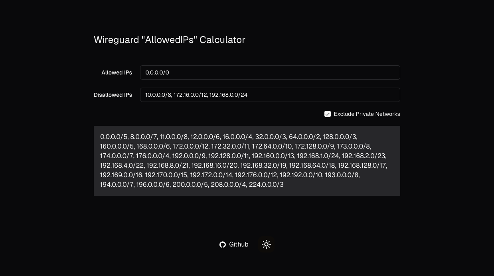
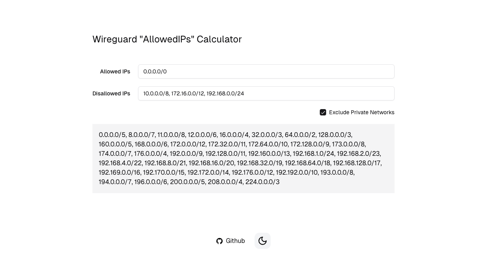

<h1 align="center">Калькулятор AllowedIPs для WireGuard</h1>

Клиентский калькулятор AllowedIPs для WireGuard с поддержкой автоматического разрешения DNS и выбора региона подключения. Может использоваться как универсальный инструмент для исключения подмножества CIDR из более широкого диапазона CIDR.

## Функциональность

- 📝 Вставьте вашу конфигурацию WireGuard для автоматического извлечения адресов
- 🌐 Автоматическое разрешение DNS для endpoint'ов
- 🗺️ Выбор региона подключения с информацией о задержке
- 🔌 Выбор порта подключения (1725, 5060, 51821)
- 📋 Копирование итоговой конфигурации в буфер обмена
- 🌙 Поддержка тёмной темы

---

  <a href="https://albatrosicks.github.io/wireguard-config-allowed-ips-calculator">Открыть приложение</a>

---

## Использование

1. Вставьте вашу конфигурацию WireGuard в текстовое поле
2. При необходимости выберите регион для изменения endpoint'а
3. Выберите порт подключения (или оставьте без изменений)
4. Добавьте дополнительные исключаемые IP-адреса
5. Скопируйте итоговую конфигурацию с рассчитанными AllowedIPs

## Технологии

- [next.js](https://github.com/vercel/next.js)
- [shadcn](https://github.com/shadcn-ui/ui)
- [cidr-tools](https://github.com/silverwind/cidr-tools)
- DNS-over-HTTPS (Cloudflare)
